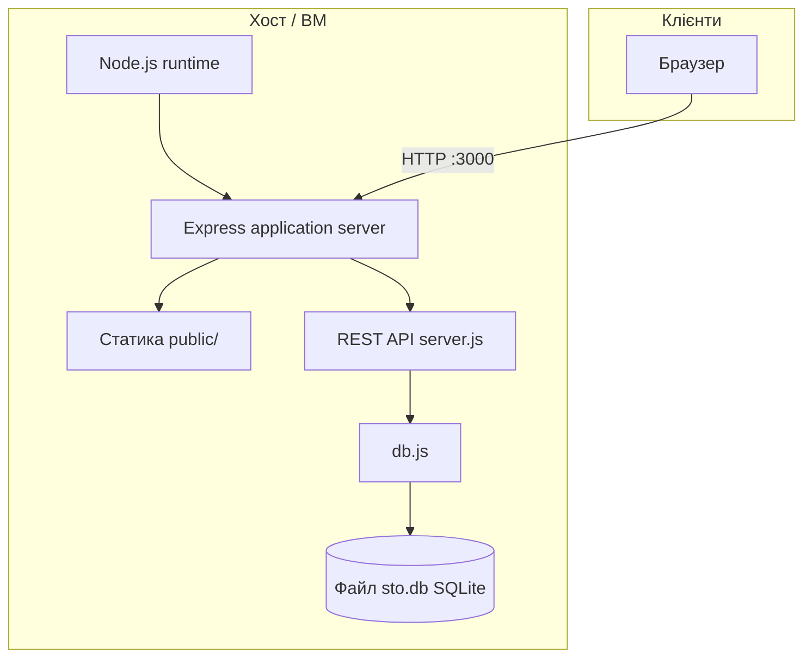

# Архітектура й складові для розгортання (підготовчий етап)

Навчальний **ERP СТО** — монолітний Node.js-додаток без окремого веб-сервера на кшталт Nginx у мінімальній конфігурації. Нижче — перелік структурних елементів і діаграма розгортання.

## Діаграма архітектури (логічна)

## Що входить у систему (відповіді на чекліст)

| Елемент | Чи є в проєкті | Коментар |
|---------|----------------|-----------|
| **Веб-сервер** (окремий, напр. Nginx/Apache) | Ні в мінімальному варіанті | Express сам обробляє HTTP і віддає статику з `public/`. У production часто ставлять **зворотний проксі** (Nginx, Caddy) перед Node — це рекомендовано в `docs/deployment-production.md`. |
| **Application server** | Так | Процес **Node.js** із застосунком **Express** (`server.js`) — єдиний рівень застосування. |
| **СУБД** | Так | **SQLite**, один файл **`sto.db`** на диску. Окремого сервера БД немає; для великого навантаження викладачу можна запропонувати альтернативу (PostgreSQL + міграції). |
| **Файлове сховище** | Лише локальне | Статичні файли в **`public/`**; БД як файл **`sto.db`**. Окремого S3/об’єктного сховища немає. |
| **Кешування** (Redis тощо) | Ні | Не використовується; за потреби — поза межами цього учбового репозиторію. |
| **Інші компоненти** | Опційно | Збірка/якість: **npm** скрипти (`lint`, `test`, `build`). **JSDoc** — лише документація. Навантажувальний сценарій **k6** (`load_test.js`) — окремий інструмент, не входить у runtime API. |

## Потоки даних (коротко)

1. Клієнт → HTTP → **Express** → маршрути REST.  
2. REST → **`db.js`** → читання/запис **SQLite** (`sto.db`).  
3. Сторінка адмінки → статичні ресурси з **`public/`** (той самий процес Node).

Детальніше про домен і ризики — у **`docs/architecture.md`**.
